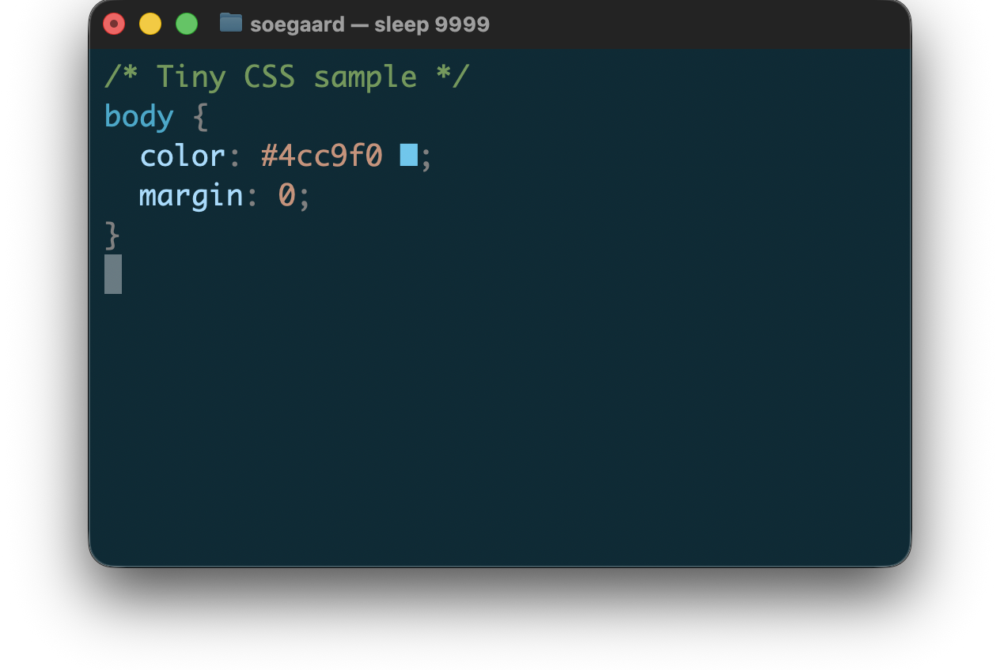
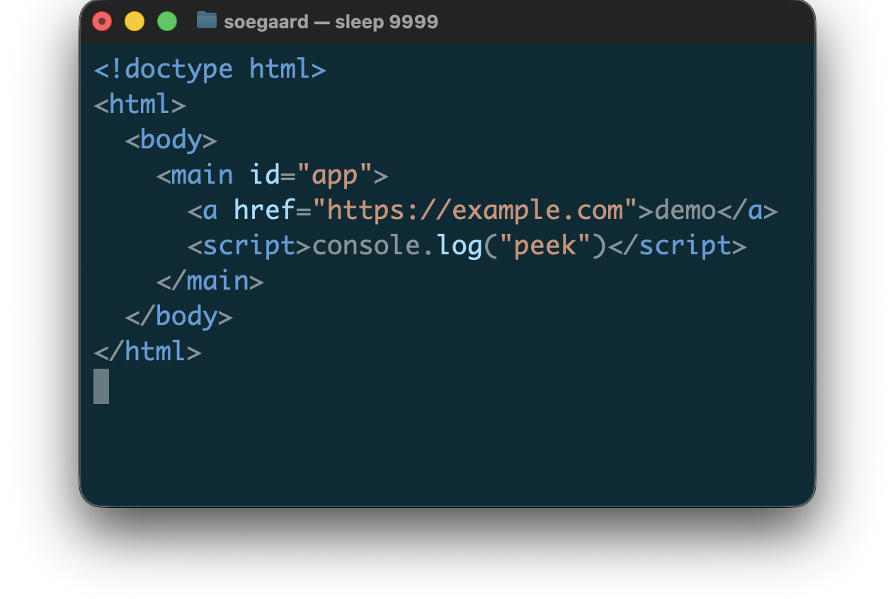
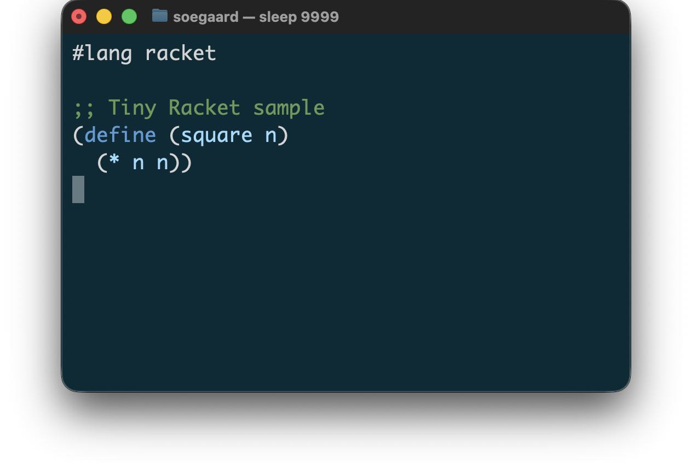
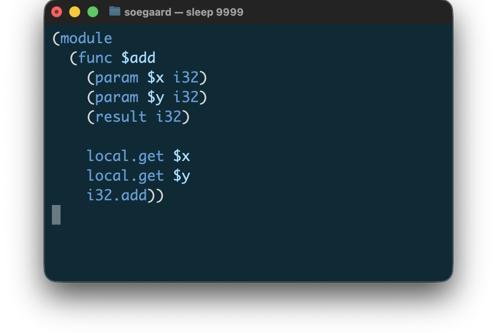

# peek

This terminal-first preview tool shows files and standard input in the
terminal.
Its goal is to keep source readable without trying to replace a pager or a
full editor.

## Install

The package is distributed as a Racket package, and installing it makes the
`peek` launcher available on the command line.

```sh
raco pkg install peek
```

## Quick Start

Preview a file directly:

```sh
peek path/to/file.css
peek path/to/file.c
peek path/to/file.sh
peek path/to/file.html
peek path/to/file.js
peek path/to/file.json
peek path/to/file.yaml
peek path/to/file.py
peek path/to/file.md
peek path/to/file.rhm
peek path/to/file.rkt
peek path/to/file.scrbl
peek path/to/file.wat
```

Preview from standard input by choosing a file type explicitly:

```sh
cat path/to/file.md | peek --type md
cat path/to/file.c | peek --type c
cat path/to/file.rhm | peek --type rhombus
cat path/to/file.json | peek --type json
cat path/to/file.yaml | peek --type yaml
cat path/to/file.py | peek --type python
cat path/to/file.rkt | peek --type rkt
cat path/to/file.wat | peek --type wat
cat path/to/script.sh | peek --type bash
```

List the currently supported explicit file types:

```sh
peek --list-file-types
```

Open output in a pager:

```sh
peek -p path/to/file.css
```

## Examples

A few small previews, rendered by `peek`:

| CSS | HTML |
| --- | --- |
|  |  |

| Racket | WAT |
| --- | --- |
|  |  |

If you want to regenerate a window screenshot, `tools/capture-peek-window.sh`
opens Terminal, runs `peek`, and captures the window as a PNG.

## Supported File Types

Current supported file types are:

- `css`
- `c`
- `bash`
- `html`
- `js`
- `json`
- `jsx`
- `md`
- `powershell`
- `python`
- `rhombus`
- `rkt`
- `scrbl`
- `wat`
- `yaml`
- `zsh`

CSS supports syntax coloring, swatches, and optional alignment. The other
current file types are color-focused terminal previews. C uses the `c`
previewer and preserves source text and line breaks without layout rewriting.
JSON uses the `json` previewer and preserves source text and line breaks
without layout rewriting. Python uses the `python` previewer and preserves
source text and line breaks without layout rewriting. Rhombus uses the
`rhombus` previewer and preserves source text and line breaks without layout
rewriting. Shell files use the `bash`, `zsh`, and `powershell` previewers and
preserve source text and line breaks without layout rewriting. YAML uses the
`yaml` previewer and preserves source text and line breaks without layout
rewriting.

## Documentation

The full manual lives in [peek-doc/peek.scrbl](peek-doc/peek.scrbl).

## Repository Layout

- `peek/` - launcher metadata for the `peek` command
- `peek-lib/` - the implementation library
- `peek-doc/` - the Scribble manual
- `test/` - regression and corpus tests

## License

The project is distributed under the MIT License. See [LICENSE](LICENSE).
